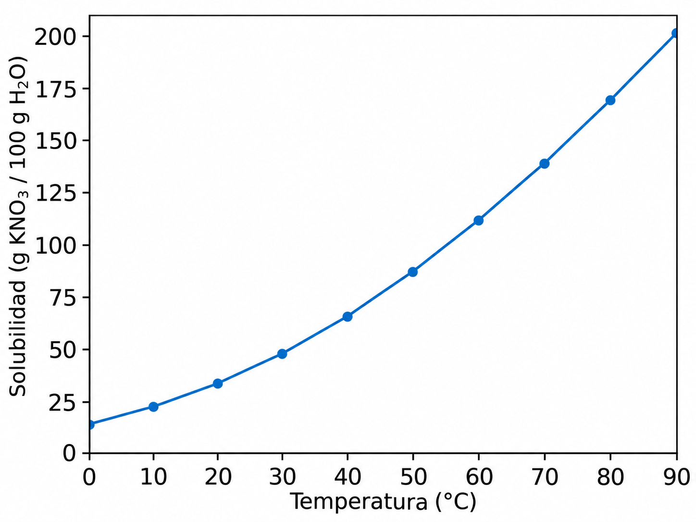

### Tablas, figuras y ecuaciones

Las tablas, figuras y ecuaciones deben cumplir con algunos requisitos mínimos para poder ser presentadas de manera clara y prolija.

Además de contener la información correcta, es importante que estos elementos sean visualmente simples y consistentes con el resto del informe. En general, se recomienda adoptar un estilo sobrio, similar al utilizado en publicaciones científicas.

Algunas recomendaciones generales son:

* utilizar fondo blanco;
* evitar sombras, degradados, efectos tridimensionales u otros elementos decorativos innecesarios;
* utilizar tipografías simples y legibles;
* mantener un tamaño de fuente suficientemente grande;
* indicar siempre las unidades correspondientes;
* mantener un formato consistente en todo el informe;
* evitar sobrecargar las figuras con información que no sea necesaria.

#### Numeración

Las tablas, figuras y ecuaciones deben numerarse de manera independiente, siguiendo el orden en el que aparecen en el documento.

Por ejemplo:

* Tabla 1
* Tabla 2
* Figura 1
* Figura 2
* Ecuación 1
* Ecuación 2

Esta numeración permite hacer referencia a cada elemento desde el texto.

Por ejemplo:

> En la Figura 1 se observa un aumento de la solubilidad al incrementarse la temperatura.

> Los valores experimentales utilizados para realizar los cálculos se presentan en la Tabla 1.

> La concentración de la solución se calculó utilizando la Ecuación 1.

---

#### Figuras

Se considera figura a cualquier elemento gráfico utilizado para presentar información visual, por ejemplo:

* gráficos;
* fotografías;
* esquemas;
* diagramas de flujo;
* estructuras moleculares;
* imágenes obtenidas experimentalmente;
* combinaciones de varios elementos gráficos.

Toda figura debe ser mencionada en el texto y debe poseer una leyenda.

La leyenda de una figura se coloca **por debajo de la figura**.

En los gráficos se recomienda:

* utilizar fondo blanco;
* indicar claramente los nombres de los ejes;
* incluir las unidades correspondientes;
* utilizar escalas adecuadas;
* evitar una cantidad excesiva de líneas, colores o símbolos;
* utilizar símbolos y líneas que puedan distinguirse fácilmente;
* evitar títulos dentro del gráfico cuando la misma información pueda incluirse en la leyenda.

El tamaño de las letras utilizadas en los ejes, escalas y leyendas debe ser suficientemente grande como para continuar siendo legible una vez que la figura sea incorporada al informe.

##### Ejemplo

La figura no debe aparecer de manera aislada. Primero debe ser introducida y posteriormente puede discutirse su contenido.

Por ejemplo:

> En la Figura 1 se muestra la variación de la solubilidad del nitrato de potasio en agua en función de la temperatura. Se observa que la solubilidad aumenta progresivamente al incrementarse la temperatura y que este aumento se vuelve más pronunciado a temperaturas elevadas.

**Figura 1.** Solubilidad del nitrato de potasio (KNO₃) en agua en función de la temperatura. La solubilidad se expresa como gramos de KNO₃ por cada 100 g de H₂O.

La leyenda debe ser suficientemente descriptiva para que el lector pueda comprender qué información contiene la figura.

No es necesario repetir exactamente la misma información en el texto y en la leyenda. El texto debe ayudar a interpretar el resultado, mientras que la leyenda debe describir qué se muestra.

---

#### Tablas

Las tablas son especialmente útiles para presentar:

* datos experimentales;
* resultados numéricos;
* valores promedio;
* desvíos estándar;
* comparaciones entre diferentes condiciones experimentales.

Toda tabla debe ser mencionada en el texto.

A diferencia de las figuras, la leyenda de una tabla se coloca **por encima de la tabla**.

Se recomienda utilizar un formato simple, evitando bordes verticales innecesarios y utilizando líneas horizontales para organizar visualmente la información.

Un formato habitual consiste en utilizar:

* una línea superior;
* una línea inmediatamente debajo del encabezado;
* una línea inferior de cierre.

Las unidades deben indicarse preferentemente en los encabezados de las columnas para evitar repetirlas en cada celda.

##### Ejemplo

> En la Tabla 1 se presentan los volúmenes de NaOH utilizados en tres titulaciones independientes de una misma muestra. Los valores obtenidos fueron similares entre sí, con un volumen promedio de 18,60 mL.

**Tabla 1.** Volúmenes de NaOH utilizados en tres titulaciones independientes de una misma muestra.

|    Determinación    | Volumen de NaOH (mL) |
| :-----------------: | -------------------: |
|          1          |                18,62 |
|          2          |                18,58 |
|          3          |                18,61 |
|     **Promedio**    |            **18,60** |
| **Desvío estándar** |             **0,02** |

En este caso, no es necesario escribir `mL` en cada celda, ya que la unidad se encuentra indicada en el encabezado de la columna.

Tampoco es necesario describir individualmente cada número de la tabla en el texto. El objetivo del párrafo es señalar los aspectos más importantes que el lector debe observar.

---

#### Ecuaciones

Las ecuaciones deben escribirse utilizando un editor apropiado siempre que sea posible.

Deben evitarse expresiones como:

`C = n/V`

cuando el procesador de texto permite presentar la ecuación utilizando una notación matemática adecuada.

Existen dos formas principales de incorporar ecuaciones en un informe.

##### Ecuaciones en línea

Las ecuaciones simples pueden incorporarse directamente dentro de una oración.

Por ejemplo:

> La densidad de una muestra se calculó utilizando la expresión $\rho = \frac{m}{V}$, donde $\rho$ representa la densidad, $m$ la masa de la muestra y $V$ su volumen.

Este formato es apropiado para expresiones relativamente breves que no interrumpen la lectura del párrafo.

##### Ecuaciones separadas y numeradas

Las ecuaciones importantes, complejas o que serán mencionadas posteriormente pueden presentarse en una línea independiente y numerarse.

Por ejemplo:

> La concentración molar de una solución se calculó utilizando la relación entre la cantidad de sustancia y el volumen total de la solución, de acuerdo con la Ecuación 1.

$$
C = \frac{n}{V}
\tag{1}
$$

donde:

* $C$ representa la concentración molar, expresada en mol/L;
* $n$ representa la cantidad de sustancia, expresada en mol;
* $V$ representa el volumen de la solución, expresado en L.

Luego, la ecuación puede volver a mencionarse dentro del texto:

> Utilizando la Ecuación 1 y los valores experimentales correspondientes se determinó la concentración de la solución problema.

No todas las ecuaciones necesitan ser numeradas. Generalmente conviene numerar aquellas que tienen particular importancia en el análisis o que serán mencionadas posteriormente.

---

#### Ejemplo integrado

A continuación se muestra un ejemplo sencillo de cómo pueden integrarse texto, tabla, ecuación y figura dentro de una misma sección de resultados.

> Se realizaron tres titulaciones de una solución problema de ácido utilizando una solución de NaOH de concentración conocida. Los volúmenes de titulante obtenidos para las tres determinaciones se presentan en la Tabla 2. Los valores mostraron una baja dispersión, obteniéndose un volumen promedio de 18,60 mL.

**Tabla 2.** Volúmenes de NaOH utilizados para la titulación de la solución problema.

| Determinación | Volumen de NaOH (mL) |
| :-----------: | -------------------: |
|       1       |                18,62 |
|       2       |                18,58 |
|       3       |                18,61 |
|  **Promedio** |            **18,60** |

> Para una reacción de neutralización con una relación estequiométrica 1:1, la concentración de la solución problema puede calcularse utilizando la Ecuación 2.

$$
C_aV_a = C_bV_b
\tag{2}
$$

> donde $C_a$ y $V_a$ corresponden a la concentración y al volumen del ácido, mientras que $C_b$ y $V_b$ corresponden a la base. Aplicando esta relación se obtuvo una concentración de $0,0763\ \text{mol/L}$ para la solución problema.
>
> La similitud entre los volúmenes utilizados en las tres titulaciones indica una buena repetibilidad de las determinaciones experimentales.

---

#### Unidades

Siempre que se presenten magnitudes físicas o químicas deberán indicarse sus correspondientes unidades.

Por ejemplo:

* masa (g);
* volumen (mL);
* concentración (mol/L);
* temperatura (°C);
* presión (kPa);
* tiempo (s).

En tablas y gráficos, las unidades deben incluirse preferentemente en los encabezados o en los nombres de los ejes.

Por ejemplo:

`Volumen de NaOH (mL)`

es preferible a colocar:

`18,62 mL`

`18,58 mL`

`18,61 mL`

en cada celda de una misma columna.

---

#### Legibilidad

El tamaño final de la fuente utilizada en tablas, figuras y ecuaciones debe ser legible una vez que estos elementos hayan sido incorporados al documento.

Puede utilizarse una fuente ligeramente menor que la del cuerpo principal del texto, pero no debe reducirse tanto como para dificultar su lectura.

Es importante verificar especialmente:

* los números de los ejes;
* los nombres de los ejes;
* las unidades;
* las etiquetas;
* las leyendas;
* los símbolos;
* las ecuaciones.

Una figura puede verse perfectamente legible mientras se está confeccionando y volverse difícil de leer después de reducir su tamaño para incorporarla al informe.

---

#### Organización gráfica

Debe prestarse atención a la distribución de los distintos elementos gráficos para facilitar la lectura y la comprensión de la información presentada.

En general, debe evitarse agregar elementos que no aporten información.

Por ejemplo, en un gráfico científico normalmente no son necesarios:

* fondos de colores;
* degradados;
* sombras;
* efectos tridimensionales;
* dibujos decorativos;
* bordes excesivamente gruesos;
* una gran cantidad de colores cuando no son necesarios.

El objetivo principal de una figura científica no es que sea decorativa, sino que permita comprender los datos de manera rápida y precisa.

---

#### Idea general

Las tablas, figuras y ecuaciones no deben colocarse como elementos aislados dentro del informe.

Cada uno de estos elementos debe cumplir una función dentro de la redacción:

* una **tabla** organiza datos;
* una **figura** permite visualizar tendencias, comparaciones o procedimientos;
* una **ecuación** expresa de manera precisa una relación matemática.

Siempre debería existir una relación clara entre el texto y estos elementos.

En otras palabras, el lector debería poder comprender:

1. por qué se presenta la tabla, figura o ecuación;
2. qué información contiene;
3. qué aspecto de esa información es importante;
4. qué conclusión puede obtenerse a partir de ella.
